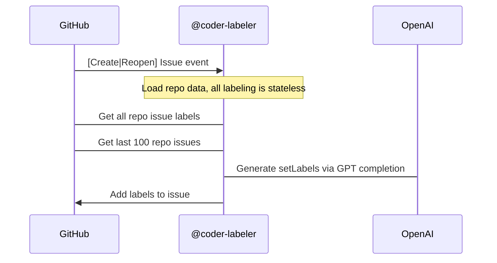

# labeler

`labeler` is a GitHub app that automatically labels newly created issues for you
based on your past labelling decisions. You can install it on your repo
[**here**](https://github.com/marketplace/coder-labeler).

We currently use it on [`coder/coder`](https://github.com/coder/coder) and
[`coder/code-server`](https://github.com/coder/code-server).

## Configuration

The labeler is configured by your label descriptions. For example, prevent the labeler from adding a `roadmap` label
by adding "Only humans may set this label" to the your `roadmap` label description. In this way, the labeler
interprets your label system in the same way a human would.

## Architecture

The labeler uses a GPT-4 completion with the past 100 opened issues instead of
a more complex vector DB / embedding system. This is because of the proven
accuracy of @cdr-bot on coder/coder and the fact that the completion approach lets us remove
the need for a DB.

On the other hand, completions are an order of magnitude more expensive, so
costs may approach ~10c per opened issue. If the project reaches a scale where that becomes an issue, we can switch to an embedding system, GPT-3.5, or accept an OpenAI key.

### Context construction

See [aicontext.go](./aicontext.go) for the code that constructs the GPT context.
